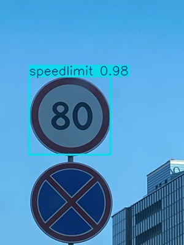
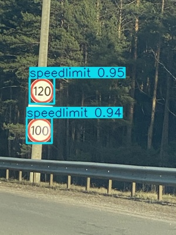

# 🚦 Road Sign Detection using YOLOv8 and Faster R-CNN

This project implements a robust road sign object detection system using **two complementary deep learning models**:

- ✅ **YOLOv8 (Ultralytics)** – Real-time, single-stage detection  
- ✅ **Faster R-CNN (TorchVision)** – Accurate, two-stage detection

Both models are trained and evaluated on a custom-labeled dataset containing **877 images** across **4 road sign classes**.

---

## 📂 Dataset Overview

- **Total Images:** 877  
- **Format:** Pascal VOC (XML → converted to YOLO format)  
- **Split:**
  - `train`: 701 images
  - `val`: 89 images
  - `test`: 87 images  
- **Classes:**
  1. `Traffic Light`
  2. `Stop`
  3. `Speed Limit`
  4. `Crosswalk`

All images and bounding box annotations are organized under the `Dataset/` folder:


---

## ⚙️ Models Trained

### 1. 🔴 YOLOv8 (Ultralytics)
- Model: `yolov8n.pt` (nano variant for speed)
- Epochs: 50
- Batch size: 16
- Optimizer: SGD
- Results saved in `runs/detect/`

### 2. 🟢 Faster R-CNN (TorchVision)
- Backbone: ResNet-50 with FPN
- Modified classifier head for 5 classes (4 + background)
- Epochs: 5
- Optimizer: SGD with momentum
- Trained weights saved as `fasterrcnn_road_signs.pth`

---

## 🧪 Evaluation Metrics (Test Set)

| Model        | Precision | Recall | F1 Score | mAP@0.5 |
|--------------|-----------|--------|----------|---------|
| YOLOv8       | 0.9432      0.8589   0.8635     0.9029  |
| Faster R-CNN | 0.9722    | 0.7836 | 0.8678   | -       |

---

## 🖼️ Predictions (Faster R-CNN)

Random predictions from the test set after inference:




> (Visuals saved in `runs/detect/predict/` and displayed using Matplotlib)

---

## 🚀 Setup Instructions

1. **Clone the repository**
   ```bash
   git clone https://github.com/yourusername/Road-Sign-Detection.git
   cd Road-Sign-Detection
